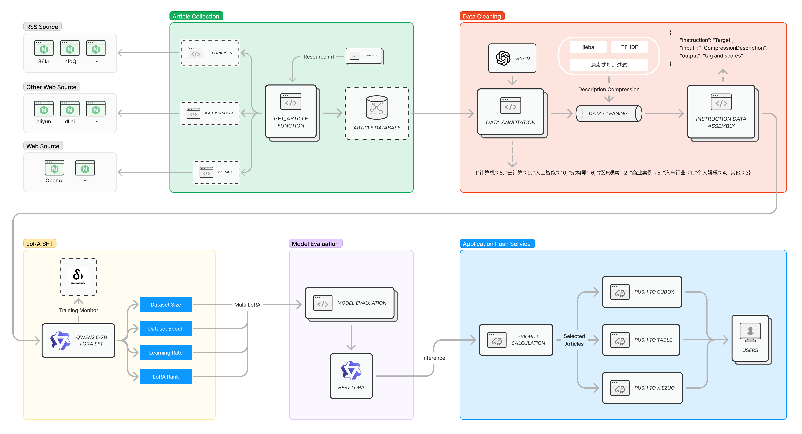

# 从0到1，“手搓”一个SA资讯推送应用服务

 

您是否沉溺于刷小红书、刷抖音无法自拔？

您是否想看SA相关的最新资讯却又不知道去哪里看，看什么？内容太多、重复性太高、关联性太低？

您是否好奇大模型全流程训练过程是怎样？想要实操却又不知从何下手，只会调用API？

 

**跟着天韵学AI，让我们一起从0到1，体验数据爬取、清洗、微调、评测，到最终应用推送。仅需一台V100虚拟机（ubuntu22.04），全链路AI落地实操，DIY一个属于自己的资讯内容推送服务吧！**

# Part 1 : 数据爬取
### 任务目标
1. 利用feedparser库爬取RSS类信息流；
2. 利用BeautifulSoup库爬取通用HTML网页元素；
3. 利用selenium模拟真实用户行为爬取特殊的网页内容；
4. 将爬取的内容插入金山云RDS。
 
# Part 2 : 数据清洗&指令数据集构建

### 任务目标
1. 利用gpt-4o、金山云瀚海，对爬取到原始资讯文章进行标注，按照不同标签进行相关性打分；
2. 数据清洗：由于爬取的文章token数过多、不均一，需要对其进行精简为500 token。使用TF-IDF对关键词提取，设计启发式规则进行过滤，最终精简为具有代表性的句子；
3. 按照Qwen微调指令集格式进行指令数据集组装构建。
   
 

# Part 3 : 基于LoRA（Low-Rank Adaptation）的有监督微调（Supervised Fine-tuning）
### 任务目标
1. 基于LoRA对Qwen2.5-7B模型进行微调；
2. 调整LoRA超参数，如LoRA Rank、Learning Rate、Epoch，以及微调数据量。得到不同的LoRA，用于后续模型评测；
3. 通过SwanLab，对训练过程中的Loss等参数进行观测。

 

# Part 4 : 模型评测
### 任务目标
1. 加载Qwen2.5-7B模型及对应LoRA权重，进行推理任务；
2. 准备评测数据集，基于该分类场景定义评测指标，并进行优化改良；
3. 对评测数据集进行推理，计算得分并利用Pandas绘图展示；
4. 分析不同Learning Rate、LoRA Rank、数据集大小下，对该任务的影响。
 
# Part 5 : 应用推送
### 任务目标
1. 根据上一步微调模型推理后的标签关联性评分，计算推送优先级；
2. 根据推送优先级，推送至Cubox第三方应用；
3. 根据推送优先级，推送至协作多维表格；
4. 根据推送优先级，推送至协作机器人。

